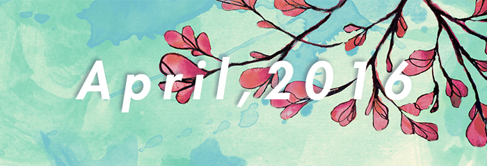

<blockquote class="blockquote-center">

这一年一直在等待，太多的巧合之后，我等到了你...

<strong> —— Robin ♥︎ Grace on April 13th, 2016</strong>

</blockquote>

<!-- more -->

如今，走出象牙塔整整两年（11月18日是我来到日本的纪念日）。现在回想，进入大学后，我自然地开始独立为自己选择老师：选择去了解什么，锻炼检索、整理与链接能力，判断读什么样的书，吸收各家之言……这种能力，与十几年的应试生涯肯定不会没有关系。我考虑着，觉得以后的自己可能选择声乐、绘画或者出版之一作为终身的「一件事」。 －－来自[《象》](http://blog.josui.me/2015-11-23-elephant-in-the-brain/)

[后稀缺](https://zh.wikipedia.org/wiki/%E5%90%8E%E7%A8%80%E7%BC%BA)

[米其林指南](https://zh.wikipedia.org/wiki/%E7%B1%B3%E5%85%B6%E6%9E%97%E6%8C%87%E5%8D%97)

什么是[阅读](https://zh.wikipedia.org/wiki/%E9%96%B1%E8%AE%80)?

[K线](https://zh.wikipedia.org/wiki/K%E7%BA%BF)

在看 RSS 订阅时，一篇文章引用了英国哲学家[培根，英文名:*Francis Bacon*](https://zh.wikipedia.org/wiki/%E5%BC%97%E5%85%B0%E8%A5%BF%E6%96%AF%C2%B7%E5%9F%B9%E6%A0%B9)的一句话：“阅读使人充实，談論使人機敏，写作使人精确。——《论学问》”，觉得写得很好。在此之前我对培根的了解是一位作家，还有就是培根肉([Bacon](https://zh.wikipedia.org/zh/%E7%85%99%E8%82%89))。于是 wiki 了一下培根的[语录](https://zh.wikiquote.org/zh/%E5%BC%97%E8%98%AD%E8%A5%BF%E6%96%AF%C2%B7%E5%9F%B9%E6%A0%B9).看完之后，我有种相见恨晚的感受。这么厉害的一个人，我长这么大都傻乎乎地没了解。

深感维基的强大：[维基多语词典](https://zh.wiktionary.org/wiki/Wiktionary:%E9%A6%96%E9%A1%B5)、[维基百科](https://zh.wikipedia.org/wiki/Wikipedia:%E9%A6%96%E9%A1%B5)、[维基新闻](https://zh.wikinews.org/wiki/Wikinews:%E9%A6%96%E9%A1%B5)、[维基物种](https://species.wikimedia.org/wiki/%E9%A6%96%E9%A1%B5)、[维基文库](https://zh.wikisource.org/wiki/Wikisource:%E9%A6%96%E9%A1%B5)、这个维基语录很不错，[維基語錄](https://en.wikiquote.org/wiki/Main_Page)、[维基教科书](https://zh.wikibooks.org/wiki/Wikibooks:%E9%A6%96%E9%A1%B5)、[Wikiversity](https://en.wikiversity.org/wiki/Wikiversity:Main_Page)、[维基导游](https://zh.wikivoyage.org/wiki/%E9%A6%96%E9%A1%B5)、[WIKIDATA](https://www.wikidata.org/wiki/Wikidata:Main_Page)

[不要試圖去做一个成功的人，要努力成为一个有价值的人。Try not to become a man of success, but rather try to become a man of value.](https://zh.wikiquote.org/wiki/%E7%88%B1%E5%9B%A0%E6%96%AF%E5%9D%A6#3.E6.9C.889.E6.97.A5)

