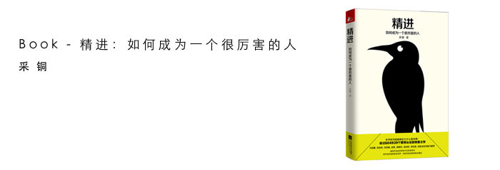

[***精进－如何成为一个很厉害的人***](https://book.douban.com/subject/26761696/)

Started from July 8th, 2016.

一个人如何对待他的时间，决定了他可以成为什么样的人。

<!-- more -->

对五年后的自己提问？你会成为什么样的人，你要怎么做。

把时间花在值得做的事情上，去投资高收益、长半衰期的事情。

你主动过滤掉的信息越多，也就意味着你越有富余的时间、精力甚至脑力来寻找和领会那些真正有价值的东西。

工作要快，生活要慢。

---

仅仅好的选择是不够的，我们需要最好的选择。

一个成熟的人，他的标准来自他的内心，而大多数的人，却受环境所左右。

一个人为自己的内心树立什么样的最高目标、设定什么样的价值尺度，反映了他的格局。

---

开始并完成一件事情，比做它更重要。

最好的时机就是现在，手头若是有太多的积压的事项，把简单的先完成掉。

我们永远无法完全准备好。

把批评当作一种信息来对待。

找到终极目标，然后分解任务。

三思而后行，三行而后思。行动先于思考的价值。

---

只有最后能够作用于现实的学习，才是唯一有效的学习。

学习要构建自己的知识体系。

技能，是学习的终点。知止很重要。

---

过滤没有价值的信息。培养简洁的表达能力。定期闭关思考。

---

努力不是一场意志力的较量，而是一中需要学习的策略。

努力需要有效的策略。

知乎有名言：以大多数人的努力程度之低，根本轮不到拼天赋。

没有突出的长板最危险。要专注发展自己的优势才能。

公司需要你有足够的长的长板来支撑公司的大木桶。

---

end on 2016年7月23日

总结：通篇鸡汤吧，方法论也是很简单，只摘抄了些句子。

