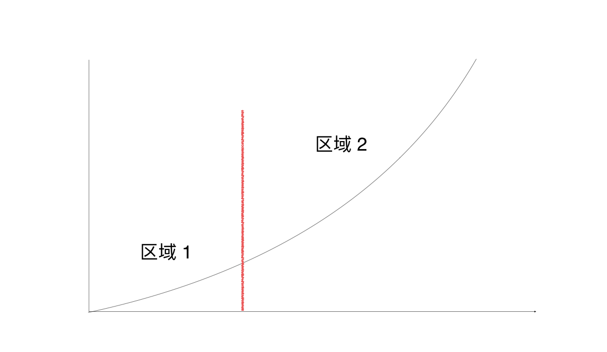
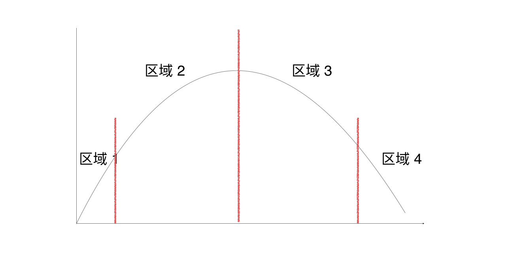

<blockquote class="blockquote-center">
既以為人己愈有，既以與人己愈多。

 —— <strong>老子</strong>

</blockquote>

<!-- more -->

简介：

	课程：《中国管理思想史》
	时间：2016年03月19日 － 
	地点：厦门大学 嘉庚二 105
	讲师：孙建国老师(我一生的恩师)

时间： **2016年02月19日 嘉庚二 105**

授课内容：[《大學》](http://www.millionbook.net/gd/z/zhuxi/000/002.htm)

大學之道，在明明德，在親民，在止于至善。

> 题外话：企管系女生好多，四周见不到几个男生。

[法约尔的五大职能](http://wiki.mbalib.com/wiki/%E6%B3%95%E7%BA%A6%E5%B0%94%E7%9A%84%E4%BA%94%E5%A4%A7%E7%AE%A1%E7%90%86%E8%81%8C%E8%83%BD)

波特竞争战略

大学校园有很多的机遇，善于利用厦大的资源。

***精通一门技艺，而不是做别人也会的基本的东西。把别人也会的东西做得更好没多大的意义！要出奇制胜。***

明明德：要知道自己。

佛的意思就是觉悟。

有时我们的分析性思维导致了我们的思维共性。与之对应的是**想象力思维**。

---

时间：**2016年02月26日 于嘉庚二 105**

明明德：自己用心生活。

明德：自我意识与要求。

人：思考，强调*心*。

动物：本能，为被动。

如何用心？知止而后有定，定而后能靜，靜而后能安，安而后能慮，慮而后能得。

知止：知道自己的方向。

老天的意志挺重要的。

---

#### 摘句：

物有本末，事有終始，知所先后，則近道矣。

物格而后知至，知至而后意誠，意誠而后心正，心正而后身修，身修而后家齊，家齊而后國治，國治而后天下平。

苟日新，日日新，又日新。

> 以***诚意***为始。

意识：意是心里想的，识是感官感受到的。

---

时间：**2016年03月04日 嘉庚二 105**

授课内容：[**《庄子•内篇•人间世》**](http://www.guoxue.com/book/zhuangzi/0004.htm)

人要知本末，知道自己要干什么。

古之至人，先存諸己而後存諸人。

**名** 与 **实**：虚名与好处。

高压环境下，忍不住时就会对自己不利。如：任自强微博被封。

不得已：一切见机行事，行则做，不行之时则应当停止。

心里有道义不管用，要有实际，要符合实际。

两喜两怒：双方都喜，美于言。双方都怒，恶之言。－“夫两喜必多溢美之言，两怒必多溢恶之言。”

我们做什么事的出发点很重要。为了名就没了德，争吵就没了真知：“德荡乎名，知出乎争。”不要以火救火，以水救水。

心斋。

利用人性的缝隙达到目的：“若能入游其樊而无感其名，入则鸣，不入则止。无门无毒。” 

达成目的不一定要用常规手段，更怕的是没有机会达成目的：“绝迹易，无行地难。”

不要改变将就，不要勉强：“无迁令，无劝成。迁令劝成殆事。”

**“意有所至而愛有所亡，可不慎邪！”：**

	愛馬的人，以竹筐接馬糞，以盛水器接馬尿。剛好有蚊虻附著在馬背上，而愛馬人出其不意的拍打，馬就會驚怒而咬斷啣勒，毀壞頭胸的絡轡。本意是出於愛而結果是適得其反，能不謹慎的嘛！」
	
匠石之齊，至於曲轅，見櫟社樹。－ **“人皆知有用之用，而莫知無用之用也**

---

时间：**2016年03月11日 嘉庚二 105**

授课内容：[《庄子•外篇•天地》](http://www.guoxue.com/book/zhuangzi/0012.htm)

天道：无为而治。

君道：有为而治。

人 －> 君 －>德 －> 天。

**“天地虽大，其化均也，万物虽多，其治一也。”**  ‘一’为天道的意思。

就事情管理人：**“上治人者，事也。”**

有技术才有能力：**“能有所艺者，技也。”**

用事情来管理多技能的人：**“技兼于事。”**

无为：管太多反而更不好。

**“物物而不物于物。”** － 不要成为物质的奴隶。

富：我有你没有。

**“泰初有无，无有无名；一之所起，有一而未形。”** － 宇宙是由天道产生的。

不要有什么标准，否则大家都会按照标准去做事。 － **“投迹者众。”**

从民所欲。

---

**时间：2016年03月18日 嘉庚二 105**

授课内容：[**《庄子•外篇•天道》**](http://www.guoxue.com/book/zhuangzi/0013.htm)

人道：*帝王之道*

元亨利贞：指 春夏秋冬。

自然怎么运行的？**无为，此谓天道。**

现代人舍本求末：过度发展。

韩非的二柄：赏罚（贪婪与恐惧）。

不要去解释，名是解释不清楚的。

**“审乎无假而不与利迁，极物之真，能守其本，故外天地，遗万物，而神未尝有所困也。”：**

了解万物的本源，抓住本就能***及末***。本意指原始的知识。

所以孔子藏书是没有意义的。

知识：

a. 显性知识。
b. 隐性知识：无法用语言来表达的知识。

> 最重要的是你看不到的东西。

---

时间：**2016年03月25日 嘉庚二 105**

授课内容：[**《庄子•外篇•天运》**](http://www.guoxue.com/book/zhuangzi/0014.htm)

应时而变。

天地的运行：不得以、不自止。

太阳：对别人好却不让人知道。

能够接受大场面，不去埋怨。看得大了，校的方面也包含了！

拿得起，放得下。

声音：声，是人发出来的。音，是演奏的。

音乐：

1. 有时让人觉得结束了，却还有。有时在高潮之处突然结束。
2. 不故：音乐清新。不常：节奏变化。
3. 好的音乐要震撼人心。

儒家思想：仁爱兼天下。“中无主而不止，外无正而不行”，内心要有，同时外部也要承认才有用。**内求而外不应，没有用** － 孔子周游列国去说服国君。讲了要有人回应才有用。故应该**应时而变**。

**“天一生水，地六承之。”** 宁波的[天一阁](https://zh.wikipedia.org/zh/%E5%A4%A9%E4%B8%80%E9%98%81)，以水制火。

见这人不仁，见那人不义，责备多了就**没有朋友了。**

> “以富为是者，不能让禄；以显为是者，不能让名；亲权者，不能与人柄。操之则慄，舍之则悲，而一无所鉴，以窥其所不休者，是天之戮民也。”

手握重权的人，不会退休。邓小平弄了个退休制。

权力可以奖赏、惩罚。

**“操之则慄”** － 得到了就恐惧。恐惧来自“名不副实”。胡锦涛访问日本时，小学生问怎样当上主席呢？

“泉涸，鱼相与处于陆，相呴以湿，**相濡以沫，不若相忘于江湖**！” － 孔子一心把“仁义”放在心中，而实际上这个可能已经不再适用了，少数人抱团取暖的，不如“相忘于江湖”。

***“性不可易，命不可变，时不可止，道不可壅。苟得于道，无自而不可；失焉者，无自而可。”*** 路是不可以挡的，时代的潮流不可阻挡。孙中山言：“天下大势，浩浩荡荡，顺之者昌，逆之者亡。”

---

时间：**2016年04月01日 嘉庚二 105**

授课内容：[老子](https://zh.wikipedia.org/wiki/%E8%80%81%E5%AD%90)的[《道德经》](https://zh.wikipedia.org/wiki/%E8%80%81%E5%AD%90_(%E6%9B%B8\))

[《道德經 (王弼本)》](https://zh.wikisource.org/wiki/%E9%81%93%E5%BE%B7%E7%B6%93_(%E7%8E%8B%E5%BC%BC%E6%9C%AC\))

据联合国教科文组织统计，《道德经》是除了《圣经》以外被译成外国文字发行量最多的文化名著。

《道德经》至高无上的统治之术。

反者道之动，弱者道之用。天之道如张弓一样，要发射弓箭就要**反其道**拉弓。

让你强大的东西让你脆弱，让你弱的反而让你强大。

VC：投资不成熟的企业，而不是类似微软这种公司。它的价值已经体现了。

> **最有价值的知识是你不知道的。**

没有冬天的萧瑟，也无春天的发生。夏天旺盛生长的，秋天就让它凋零。

天之道：损有余而补不足。

人之道：损不足以奉有余。

“道可道，非常道。” － 无确定的对错，无逻辑的自恰。每个人都想长生不老，而没想到每个人都这样会怎样。

**功成身退**：到达一定的目的之后就要停止。学到知识之后，要｀去做自己感兴趣的。而不是一只往里面钻。
	1. 微软二十多年还在开发 Windows。
	2. Google 从搜索起家到一定程度之后，转到了无人汽车。
	3. 微软第一个发明了 Pad，怕冲击 Office 市场，枪毙了这个项目。柯达何尝不是呢？
	

**“常道无为，而无不为。”**：

有为之道才是无为。只有无为才无不为。抱着已有的知识不放的话，就会受限，类似[所知障](https://zh.wikipedia.org/zh/%E6%89%80%E7%9F%A5%E9%9A%9C)。要无为才可以创新。近代的发展退化就是因为**守成（农业）**。只有**打破自己已知**知识圈。“为学日益。为道日损。” 

> 学习之时要多学，创新之时要重新开始。

道善贷且成（贷：给别人。自己已有。）：有多的就给别人。保持学习，不断有新知识。

道之华而愚之始：一直讨论已有的问题(资社主义哪个好)没有什么意义了，打破旧有的框框架架。

**道常无名**：不知道创新是什么。如果知道创新是什么的话，**那不是创新**。

1. 打破出租车框架，重新定义出租车，让闲置的私家车称为出租车：Uber。
2. 未打破出租车框架，优化已有的出租车：滴滴。
3. Apple 的产品没有说明书。打破旧有的产品需要复杂的说明书。

**“不争之争”**是最高明的***争***。在相同的领域竞争一定要付出代价。直到厮杀到寡头。

**“功成身退”**是最大的成功。例如，通用电气的韦尔奇。

**“圣人之道”**不是巩固，而是创新。

以前经济发展：损不足以奉有余。

**“天下之道，却走马以粪。”**让马运粪。

人之道：使用打仗。

**“大道泛兮，其可左右。”** － 创新可以从身边开始发现。思考：我们有什么？可以做什么？可以怎么做？

“道生一。一生二。二生三。三生万物。” － 这个***一***很重要。

iPhone －> App Store －> iPad －> Apple 其他产品。

产品过程图，如下：

区域 1 是 未知的创新阶段。**“道隐无名”**。
区域 2 是 人人都知道的阶段。**“道之华而愚之始”**。

教育的本质是什么？***教育不是告诉你什么。而是教你探索什么。***

---

时间：**2016年04月08日 嘉庚二 105**

授课内容：《道德经》

### 自然：

1. 变化之道（非常道）

	* 自然变化（如地震。）
	* 天人合一（人作用于其中。创新创造的机遇在这里。例如古人用火的过程：烤肉更加好吃。生火取暖。烧陶瓷。然后发明了蒸汽机。）

		天人合一特点：1.有生命周期(如今已不再使用钻木取火了)。2.有起有落。3.自然兴衰。
	
2. 不变之道（常道，即规律）

	道生之，德蓄之。道在古汉文中：意指一个人走在路上，路走了就有了。德在古汉文中包含：人的行为。头发。眼睛。心。四个方面。

区域 1：	探索阶段。从0到1.专注于探索阶段，其他的业务外包。

区域 2: 	发展兴旺阶段。大多数人从这里开始跟随。**“随之不见其后。”**

顶点：	开始要走下坡路了。人们总会在这个点看到好处，而追随其中。**而当每个人都觉得好的时候，这个行业就不好了！**

区域 3：	下坡阶段。

区域 4:	没落阶段。

**希言自然。骤雨不终日。** － 小雨可以下一整天，大雨不能够下一整天。 － 思考：靠补贴驱动的产品**不可持续**。

“浊以静之徐清。” － 水静放可以变清澈。放久了又会坏掉。故**“安以动之徐生”**。

**持而盈之，不如其已。** － 边际思维。到达了顶点之后开始放弃。

成就你的毁掉你：**柯达**。在顶点的时候放弃会很痛苦。

好起来有惯性。坏起来也有惯性。

**如何立于不衰之地**：***“不 欲 盈”***，舍得，有舍有得。

**“曲则全。枉则直。洼则盈。多则惑。”**

我们总是喜欢用望远镜看自己的缺点，用放大镜看自己的优点。

侯王自称孤、寡、不谷。 － 别人不做坏人，我做坏人。

**“圣人不积”**。**“既以为人己愈有。既以与人己愈多。”** － 给别人的越多，自己就得到越多。（很重要）

与陈嘉庚同时期福建类似陈嘉庚的富豪还有两三个。陈嘉庚即使后来生意失败了，但是还是留下来厦门大学，得到了名声。

---

时间：**2016年04月15日 嘉庚二 105**

授课内容：《道德经》

> 上善若水。水善利万物而不爭，處眾人之所惡，故几于道。
居善地，心善淵，与善仁，言善信，政善治，事善能，動善時。
夫唯不爭，故無尤。

**永续创造之德，历久不衰之道。** － 基业长青。

1. 一切都是辩证思维。要居安思危。孙中山言：“天下大势，浩浩荡荡，顺之者昌，逆之者亡。”

2. 惯性思维。总觉得一切会很好。

3. 边际思维。**“持而盈之。揣而锐之。”** 解决方式：*“不 欲 盈”*

**“浑其心”** － 浑心才会有辨证。从民所欲（老百姓觉得什么好就是什么好）。别人说好的你说好，别人就信服你。别人说好你说不好，**就没人理你了**。

### **浑心**：

1. 普济世人。第62章。善人与不善之人是浑然一体的。**“人之不善，何弃之有。”** － 有道者要**帮助**不善之人。 资本主义不朽就是因为 把“善人”的钱征税，救济穷人。日本人让索马里的海盗帮助捕捞金枪鱼赚钱，他们就慢慢放弃了当海盗。
2. 分享利益。第81章。**“圣人不积。”** － **“既以为人己愈有。既以与人己愈多。”** － 例如：[陈嘉庚](https://zh.wikipedia.org/wiki/%E9%99%88%E5%98%89%E5%BA%9A)留下校主美名。
3. 节俭。第59章。**“治人事天莫若啬。”** － 提倡节俭。中国人喜欢吃动物内脏可能是因为以前食物短缺。
4. 保护自然。第52章。**“天下有始，以为天下母。既得其母，以知其子。既知其子，复守其母，没身不殆。”** － 知道我们来自哪里就要保护自然。**“无遗身殃”** － 不要只顾自己好，把受罪留给后人。

### **有道**：

1. 第35章。**“执大象，天下往。”** － 谁奉行了大道，天下就归附于谁。
2. 第41章。分上、中、下士。**“上士闻道，勤而行之。”** **“进道若退。”** － 舍弃已有的业务，在表面上看财报可能不好看，而实际上是前进的。*学生*：能力很强，却没有兴趣。**“建德若偷。”** － 偷东西时**很专注**。
3. 第24章。**“企者不立，跨者不行。”** － 保持空杯的心态，要经常清空自己。

### **执行（善施）**：

1. 第53章。**“使我介然有知，行于大道，唯施是畏。”** － 施：执行。***“大道甚夷，而人好徑。”*** － 人总是投机取巧，喜欢捷径，例如*“多 快 好 省”*。
2. 第8章。**“上善若水。”** － 水有七善。*“居善地”* － 水往下流，总是处在恰当的地方。对应来说，产品的市场定位很重要。“都市丽人”案例，管院捐了1000万。*“心善渊”* － 想得要有深度。*“言善信”* － 春天一来，准时下雨。*“与善仁”* － 给需要的人。*“事善能”* － 让有能力的人来做事。*“功善时”* － 抓住适当的时机做事，方能成就大业。
3. 第63章。**“图难于其易，为大于其细。”** － 把‘易’事做完就把‘难事’做完了。***“夫轻诺必寡信，多易必多难。”*** － 把握事物的本末，由 *本* 及 *末*。

---

时间：**2016年04月22日 嘉庚二 105**

授课内容：《道德经》。分析创造者的 *人格特质* 和 *身心修养*。以及，领导的 *行为方式* 和 *行为准则*。

创造者的人格特质：21章、25章。

创造者的身心修养：12章、16章、45章。回归根本。**“致虚极守静笃”** 大智若愚。**“.大成若缺，其用不弊。大盈若冲，其用不穷。大直若屈。大巧若拙。”** － 不心燥。

领导的行为方式：第60、28、66、72、16章。**“治大国若烹小鲜。”**、**“知其雄，守其雌。知荣守辱。”**、**“以其不争。故天下莫能与之争。”**、**“民不畏威，则大威至。”**、**“致虚极守静笃。知常曰明。”**

领导的行为准则：第45、7、49、91、26章。

---

时间：**2016年04月29日 嘉庚二 105**

授课内容：[《韩非子》](https://zh.wikipedia.org/wiki/%E9%9F%A9%E9%9D%9E%E5%AD%90)，[韩非](https://zh.wikipedia.org/wiki/%E9%9F%A9%E9%9D%9E)。本节讲授 *二柄* 和 *八奸*。

### 二柄：

> 君主应当抓住臣下对此畏威趋利的心理，此为韩非对君主‘术’的法家思想。

1. 审核刑名。功与名要一致。做到的要和指标一致。超过指标太多说明前面指标有问题。
2. 赏罚在君。
3. 去好去恶。不要刻意表露自己的喜好，以免大家对着标准去做。
4. 越官则死。专业化分工，职与责要分明。

行使二柄最难的点：权威。有权且有威。有权无威也不行。

赏罚：赏让人有利；罚让人恐惧。合理行使二者是**关键**。

纵观各个朝代，开国者有绝对的权威，往后的一代一代随着时间权威下降了，于是领导不力，朝代更迭。

### 八奸：

> 韩非认为君主专制的统治力，会受到臣下经由八种手段之一的干涉，进而演化成为奸谋政权者。

因权而生。腐败来自权力。

八奸至今还存在着。

题外的思考：
	
	中国应该称为中国人的乐土，大家喜欢在这里生活、工作。
	
[“家天下” 与 “公天下”](https://zh.wikibooks.org/zh/%E4%B8%AD%E5%9C%8B%E6%AD%B7%E5%8F%B2/%E5%A4%8F%E6%9C%9D)

> 以上笔记是 2016年04月29日 － 30日 进行整理并丢弃纸质笔记。 于 图书馆三楼走廊圆形桌。

--- 

时间：**2016年05月06日 嘉庚二 105**

授课内容：[《五蠹》](https://zh.wikipedia.org/wiki/%E9%9F%A9%E9%9D%9E%E5%AD%90#.E4.BA.94.E8.A0.B9.E7.AC.AC.E5.9B.9B.E5.8D.81.E4.B9.9D)

<blockquote class="blockquote-center">
世异则事异，事异则备变。

 —— <strong>韩非</strong>

</blockquote>

民固骄于爱，听于威矣。

坚甲利兵异备难，而美荐绅之饰。

国家利益、社会利益、个人利益，有时相互契合，有时相互矛盾冲突。

韩非认为一个国家只需要两种人：**农民 和 士兵**，即*耕* 与 *战*。

上古竞于道德，中世逐于智谋，当今争于气力。

民者固服于势。

> 应执势而美以仁义之饰，外儒内法。

执势：让别人怕我。／ 仁义：让别人爱我。

个人觉得好的国家不一定觉得好，两者之间便好、目的不一样。

例如：股市中，国家希望多个新的面包🍞加进来，而实际上是几个旧的面包一直的瓜分。

国企的存在有统治的需要。

中国人四大名著中，大家喜欢看《水浒传》的原因可能是因为长期受欺负，**缺什么看什么！**。《红楼梦》也是一样。

历史上，谈到国家与百姓之间的关系，有比较重要的两篇，其一是《五蠹》，再者是《盐铁论》。

相关：

[《盐铁论》](https://zh.wikipedia.org/wiki/%E7%9B%90%E9%93%81%E8%AE%BA) - 讲如何增加财政收入。盐和铁是老百姓的必需品，从西汉到现在，盐仍然是国营的。

---

时间：**2016年05月13日 嘉庚二 105**

授课内容：[《扬权》](https://zh.wikipedia.org/wiki/%E9%9F%A9%E9%9D%9E%E5%AD%90#.E4.BA.94.E8.A0.B9.E7.AC.AC.E5.9B.9B.E5.8D.81.E4.B9.9D)

<blockquote class="blockquote-center">
圣人执要，四方来效。

 —— <strong>韩非</strong>

</blockquote>

故圣人执一以静，使名自命，令事自定。

审名以定位，明分以辨类。

故去好去恶，虚心以为道舍。

欲治其内，置而勿亲。

有道之君，不贵其臣；贵之富之，彼将代之。

掘其根本，木乃不神。

我的思考：*领导只是被任命到他擅长的职位中，做他擅长的事。*

> 事在四方，要在中央。

圣人执要 － 指挥是演奏的核心。

专业技能很好培养，而领导力却很难得。

> 四海既藏，道阴见阳。

－ 胸怀四海，却躲在阴处，看着阳处。

> 左右既立，开门而当。

左右：指文武。 开门：指耳朵和眼睛。 这句话表示静静去听。

人尽其材，物尽其用，各司其职。

**“财者有所施，各处其宜。”** － 用人之长处。

形名：“形”是做得，“名”是说的。

**使名自命，令事自定。**

“去巧与智” － 巧智用于事，而领导需要执**“要”**，即‘道’。

**“道不同于万物，德不同于阴阳，君不同于群臣。”** － 在其上而不同于其，例如，称可以称量万物的重量，却不同于万物。

如何倾听？

如醉酒。大臣说话希望君主肯定，一肯定就完蛋了。

**“听言之道，溶若甚醉。”**

常常，人们在听到时就马上进行肯定或者否定。

不要表态！说了就要落实、执行和反馈。

如天气一样，长期可知，短期不可知。领导要让人知道“大趋势”，而不现于细节。

**"欲治其内，置而不亲；欲治外事，官置一人。"** － 让一个人管理一件事情，形名也。

**“毋富人而贷焉，毋贵人而逼焉，毋专信一人。”** － 不要使人富有而自己要去贷，不要使人太显贵自己反而受逼。

**“一栖两雄。”** － 不能把大臣养大。

**“豺狼在牢，其羊不繁。”** － 不能培养豺狼。也如树的枝干，把树的枝养大了，干就会遭殃。

---

时间：**2016年05月21日 嘉庚二 105**

授课内容：无。

*原因：老师请假去参加哈佛讲师课程。*

---

时间：**2016年05月27日 嘉庚二 105**

授课内容：[《易经•系辞》](https://zh.wikipedia.org/wiki/%E6%98%93%E7%BB%8F)

<blockquote class="blockquote-center">
天行健，君子以自强不息。

 —— <strong>《易经》</strong>

</blockquote>

八卦的意义：*类比性思维。*

占卜：一般情况下，讲了六条通用的，总有一条适合你。

“不出户庭，无咎” － 乱之所生也，言语以为阶，君不密则失臣，臣不密则失身，几事不密则害成。

我们的思维中，对待一件事情一定要明白什么回事，而越是想弄明白就越是不明白。

有些东西我们先要尝试去接受它，等时间去印证。亦如“书读百遍，其义自现”也。

##### 课程结束! 

###### －EOF－

