在现代的 Web 项目中，较为常见地采用了 ES6 和 webpack。通常，我们对 ES6 的模块 和 webpack 的细节不那么清楚。本文通过一个 case 深入浅出，从微观细节引出两者的机制核心！

<!-- more -->

本文假设你已经了解了 ES6 模块机制和 webpack 打包机制！

## 一、项目基本信息：

Webpack 版本：

```
"webpack": "^1.13.1",
"extract-text-webpack-plugin": "^1.0.1",
"webpack-dashboard": "^0.1.8",
"webpack-dev-server": "^1.14.1",
"webpack-md5-hash": "0.0.5"
```

Babel(ES6) 版本：

```
"babel-core": "^6.10.4",
"babel-eslint": "^6.1.2",
"babel-loader": "^6.2.4",
"babel-plugin-transform-runtime": "^6.12.0",
"babel-preset-es2015": "^6.9.0",
"babel-preset-react": "^6.11.1",
"babel-preset-stage-0": "^6.5.0"
```

React\Redux:

```
"react": "^15.2.1",
"react-redux": "^4.4.5",
"react-router": "^2.5.2",

"redux": "^3.5.2",
"redux-logger": "^2.6.1",
"redux-thunk": "^2.1.0",
"react-redux": "^4.4.5"
```

----

项目模拟目录结构：

```
├─┬ actions
│ ├── A.js
│ └── B.js
├─┬ components
│ ├── A.js
│ └── B.js
├─┬ containers
│ ├── A.js
│ ├── B.js
│ └── App.js
├─┬ reducers
│ ├── A.js
│ ├── B.js
│ └── index.js
└── App.js
```

----

示例代码：


```
// actions/A.js

const Actions = {
	
};

export default Actions;
```


```
// actions/B.js

const Actions = {
	
};

export default Actions;
```


```
// components/A.js

import React, { Component } from 'react';

export default class A extends Component {
    constructor(props) {
      super(props);
    
      this.state = {};
    }

	render = () => (<div>Component A</div>);
} // class
```


```
// components/B.js

import React, { Component } from 'react';

export default class B extends Component {
    constructor(props) {
      super(props);
    
      this.state = {};
    }

	render = () => (<div>Component B</div>);
} // class
```


```
// containers/A.js

import { connect } from 'react-redux';
import Actions from '../actions/A';
import A from '../components/A';

const mapStateToProps = (state) => JSON.parse(JSON.stringify(state.A));

const mapDispatchToProps = (dispatch) => {
  const fnProps = {
    // nothing
  };
  return fnProps;
};

export default connect(mapStateToProps, mapDispatchToProps)(A);

```


```
// containers/B.js

import { connect } from 'react-redux';
import Actions from '../actions/B';
import B from '../components/B';

const mapStateToProps = (state) => JSON.parse(JSON.stringify(state.B));

const mapDispatchToProps = (dispatch) => {
  const fnProps = {
    // nothing
  };
  return fnProps;
};

export default connect(mapStateToProps, mapDispatchToProps)(B);

```


```
// containers/App.js

import React, { Component } from 'react';
import {Router, Route, IndexRoute, IndexRedirect, Redirect, browserHistory} from 'react-router';
import Frame from '/somePath/Frame';

import A from '../containers/A';
import B from '../containers/B';

class App extends Component {
  constructor(props) {
    super(props);
  }

  render = () => {
    return (
      <Router history={browserHistory}>
        <Route path='/' component={Frame}>
            <Route path='a' component={A}/>
            <Route path='b' component={B}/>
        </Route>
      </Router>
    );
  }
}

export default App;

```


```
// reducers/A.js

const initialState = {
  
};

const Reducer = (state = initialState, action = {}) => {
  switch (action.type) {
    default:
      return initialState;
  }
};
export default Reducer;
```


```
// reducers/B.js

const initialState = {
  
};

const Reducer = (state = initialState, action = {}) => {
  switch (action.type) {
    default:
      return initialState;
  }
};
export default Reducer;
```


```
// reducers/index.js

import { combineReducers } from 'redux';
import A from './A';
import B from './B';

export default combineReducers({
	A,
	B
});
```


```
// /App.js

import React from 'react';
import { render } from 'react-dom';
import { Provider } from 'react-redux';
import { createStore, applyMiddleware } from 'redux';
import App from './containers/App';
import reducer from './reducers/index';
import thunk from 'redux-thunk';

const store = createStore(
	reducer, 
	window.devToolsExtension && window.devToolsExtension(), 
	applyMiddleware(thunk)
	);

render(
  <Provider store={store}>
    <App />
  </Provider>,
  document.getElementById('root')
);

```

----

## 二、出现的问题：

项目在使用 `webpack-dev-server` 构建的时候，可以运行；而使用 `webpack build` 打包压缩之后，运行就出现错误：

```
lib.js:formatted:10 Uncaught TypeError: Cannot read property 'call' of undefined(…)

```

***经过用例测试，该错误会在以下几种情况下出现：***

1.
添加几句评论，就不会出错：

```
// 添加几句评论，就不会出错
export default class Actions {
	k = () => () => {}
}
```

----

2.
添加空格回车，来区别也没有用：

----

3.
不同变量名下管用：

```
export default class Actions {
	j = () => () => {

	}
}

export default class Actions {
	k = () => () => {

	}
}

```

----


4.
这种情况下，无论怎么修改变量的名字都没有用，编译处理后的变量的值是一样：

```
export default class Actions {
	k: (() => () => {})
}

```

----


5.更换 class 名字也不顶用：

```
export default class Action {
	k: (() => () => {})
}
```

----

6.同名，同值下不行；不同命，同变量下可以：
```
const Actions = {
	ActionsNewTask: () => () => {}
};

export default Actions;
```
----


> 在 dev 环境还可以运行，为什么通过 `build` 打包压缩后运行就挂了呢？

## 三、初步结论：

经过一番排查，发现是由于 ES6 模块加载机制在 Webpack `打包压缩后`，两个不同的变量访问两个本应不同的模块，但是由于 Webpack 的打包机制`优化时`视这两个不同模块为同一个模块，因而只压缩了一个模块，而另外一个模块因此通过其对应的变量访问同一个模块时，重复实例化该模块所致。

下面我们来验证这个初步猜想的结论！


----

首先，显然我们来看一下 ES6 的模块机制！

## 四、ES6 的模块机制：

### export:

1. 导出表达式（包括变量<通过 let、const、var 等声明而成>、字面值<'hello world!'、(function (){})等>，只导出表达式的最终结果值，与表达式名无关(换而言之，就是表达式的结果的引用，通过这个引用可以访问这个值)；
2. 导出 class、function、function* 时，导出 `声明(declarations)`;

### import:

1. view on import, can't change value directly

----

## 五、ES6 的模块具体调用机制：

### 陈述几个概念：

***抽象模块记录([Abstract Module Records](http://www.ecma-international.org/ecma-262/6.0/#sec-abstract-module-records))***，这个记录包含四个字段名(field name):

1. 作用域([[Realm]]) - 在所有 ES6 标准之下的代码调用之前，都要关联一个作用域(Realm)。从概念上讲，Realm 包含了 ECMAScript 全局环境([[globalThis]]\[[globalEnv]])、Realm 本身自己的值([[intrinsics]])以及其他一些相关的状态和资源([[templateMap]])。
2. 语义环境([[Environment]]) - 语义环境包含了本模块代码顶层逻辑的一些绑定，这个字段在模块实例化的时候被设置。
3. 命名空间([[Namespace]]) - 通过 `import(export) * as ImportedBinding` 这样的语句进行名空间导入和导出的，模块会构建一个 Namespace Object。
4. 执行完成状态([[Evaluated]]) - 在初始化的状态下这个值为 `false`，当模块被调用时设置为 `true`，在调用完成之后，保持为 `true` (即使在抛出异常完成的状态下，也保持为 `true`)。


> 异常完成状态(abrupt completion)：ES6 中代码执行的完成状态(Completion type)有 5 种： normal, break, continue, return, or throw，而异常完成状态指的是除了 `normal` 状态之外的所有状态


***模块记录的抽象方法(Abstract Methods of Module Records)*** :

1. GetExportedNames(exportStarSet) - 该方法返回本模块中直接或间接导出的所有名称；
2. ResolveExport(exportName, resolveSet, exportStarSet) - 返回本模块中名为 exportName 的绑定；
3. ModuleDeclarationInstantiation() - 处理所有的模块依赖，并从模块中构建 Environment Record。
4. ModuleEvaluation() - 这个方法在本模块调用执行完成的情况下不做任何事，并返回 `undefined`；在未被调用的情况下，该方法调用所有的模块依赖，然后执行这个模块(同时， 本方法在 `ModuleDeclarationInstantiation()` 执行完成后才会调用本方法)。

*related:* runtime 下 ES6 如何处理模块？请直接[查看文档](http://www.ecma-international.org/ecma-262/6.0/#sec-parsemodule)。

下面讲着重讲一下跟这个 case 关系比较大的 `ModuleEvaluation()`：[ModuleEvaluation() Concrete Method](http://www.ecma-international.org/ecma-262/6.0/#sec-moduleevaluation)， 这个是 ES6 下模块调用的抽象方法！

从 ecma 文档中，`ModuleEvaluation()` 第 4 个步骤和第 5 个步骤提到：

4.If module.[[Evaluated]] is `true`, return `undefined`.

5.Set module.[[Evaluated]] to `true`.


也就是说，如果一个模块一旦通过 `ModuleEvaluation()` 初始化后再调用一次 `ModuleEvaluation()` 的话，将会返回 `undefined`(这也是本文错误产生的原因之一)。

## 六、Webpack 构建机制：

接着，在剖析本 case 之前，还需要了解一下 webpack 的构建机制。

我们需要弄清 webpack 构建时如何优化项目代码？请直接[查看文档](https://github.com/webpack/docs/wiki/optimization)，其中重要的一条：

1. 去重(Deduplication)：webpack 会通过依赖树来把相同的文件找出来，然后去重。

----

## 七、重回 case 主题：

从这里我们可以再回头看看本 case 最开始提到的错误描述：

经过 `webpack build` 打包后打开页面：

1. 出现白屏；
2. 错误提示：`lib.js:formatted:10 Uncaught TypeError: Cannot read property 'call' of undefined(…)`


### 追踪错误栈如下图：

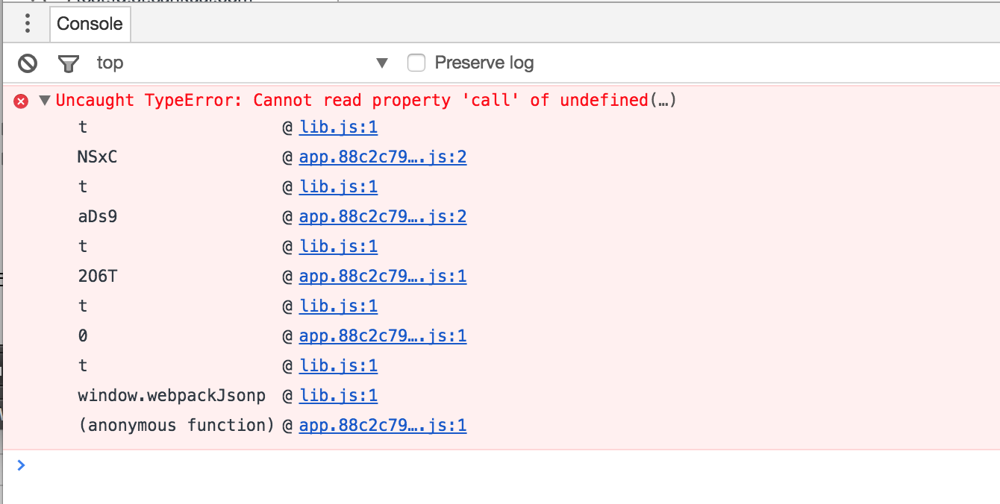

上图1：错误栈。其中 `webpackJsonp()` 用于异步加载代码块(chunks)，具体请查看[output.jsonpFunction](https://webpack.github.io/docs/configuration.html#output-jsonpfunction)

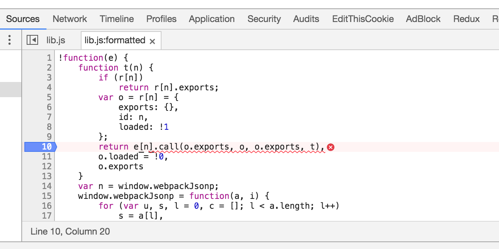

上图2：这句代码触发了错误

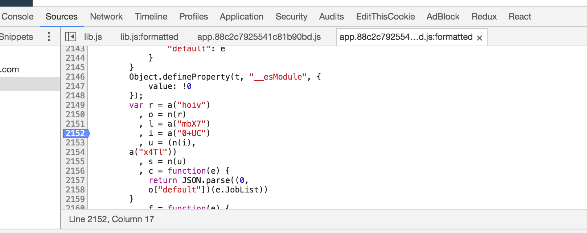

上图3：这句代码触发了错误

### 下面具体阐述一下错误发生的过程：

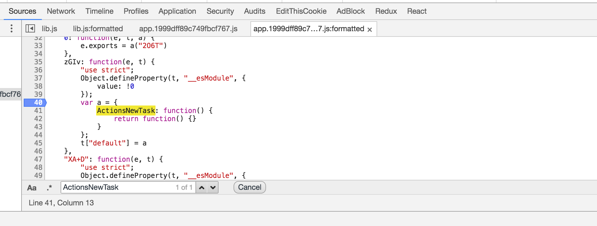

上图4：注意现在这个还是只有一条搜索记录

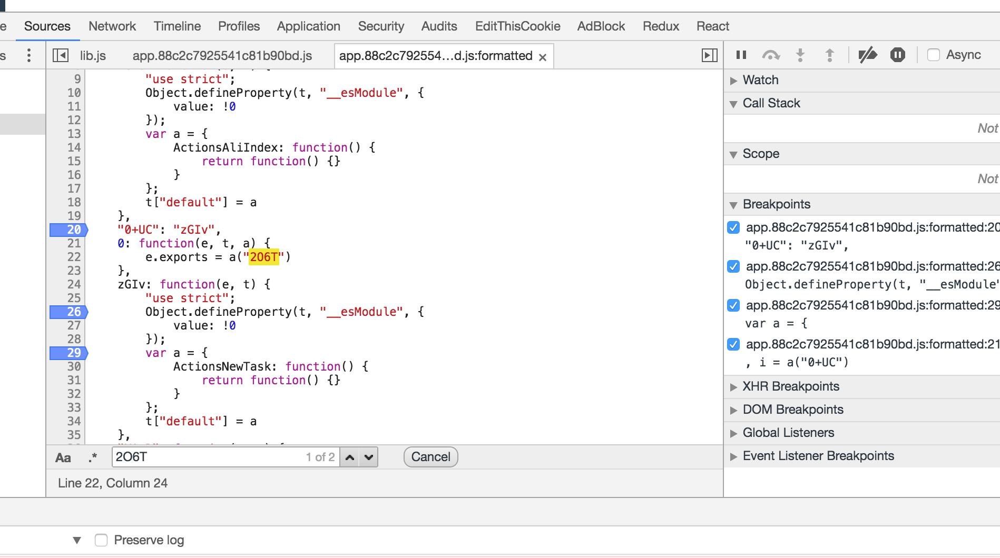

上图5：注意第 20 行，这度代码的意思是，当访问 `0+UC` 时，去调用 `zGIv`，也就是执行第 24 行中的代码。

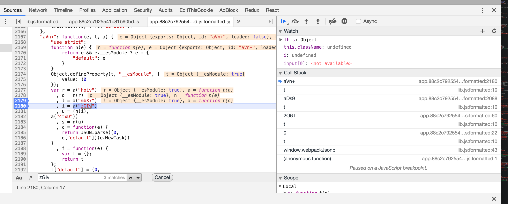

上图6：`aVn+` 初始化的时候， 已经初始化过 `zGIv`(在第 2180 行调用)，这是 `zGIv` 模块第一次被初始化，此时 `zGIv` 模块会被标记为 `loaded: true`。按照 ES6 的模块机制来说，每个模块只能实例化一次(TODO: 详细见 [ES6 模块文章]())。

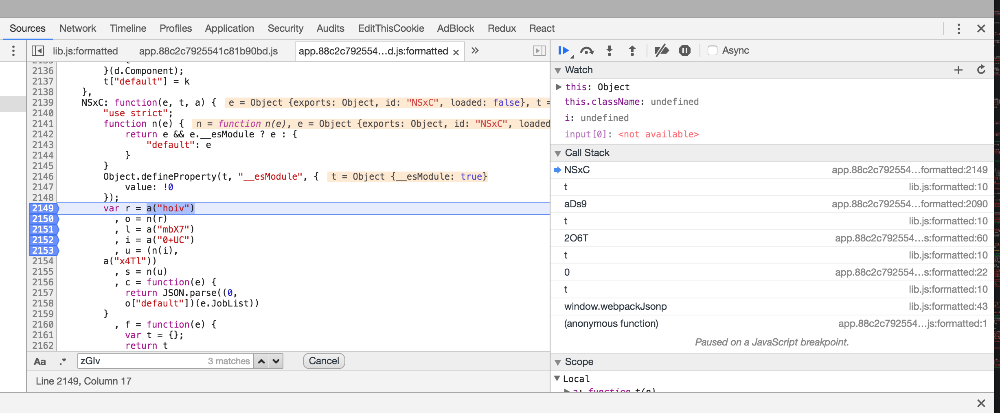

上图7：在这里，`NSxC`(第 2139 行) 模块加载的时候需要加载 `0+UC` 模块(第 2152 行)模块，而调用 `0+UC` 模块时，又去加载了一次 `zGIv` 模块，具体请看(图5)。这时候，再一次初始化 `zGIv` 模块，OK，`zGIv` 模块被二次加载，***出错***。

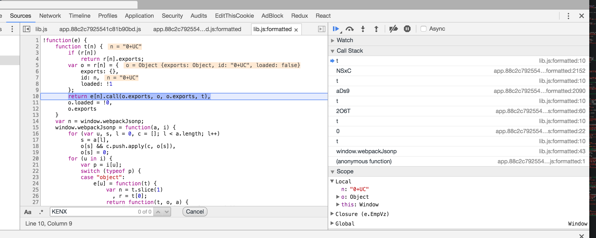

上图8：在第一次加载(在图6中) `zGIv` 模块的时候，执行到上面这张图片中第 10 行 `return ` 语句代码的时候，在第 11 行 `o.loaded = !0`，`loaded` 属性被设置为 `true` ，最终在第 12 行代码中 返回 `o.exports`。而当第二次调用 `0+UC` 模块时(在图7步骤) ，执行到这段代码就会出错，请看下图。


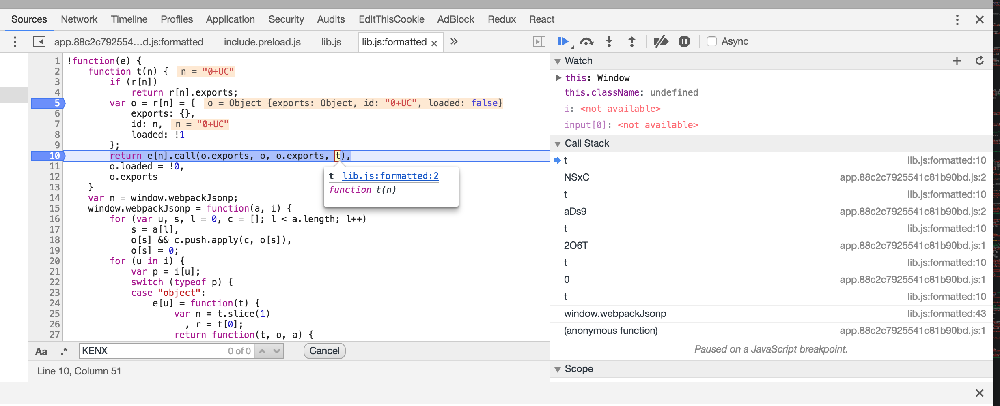

上图9：请先看上图中第 5 行代码，要被夹在模块 `0+UC` 的 `loaded` 状态还是 `false`，并且跳过了第 3 行 `if(r[n])` 步骤开始执行第 10 行，这时候可以执行没有错，具体是怎么执行的呢？当第 10 行代码执行 `e[n].call(o.exports, o, o.exports, t)` 语句的时候，在语里面调用 `t(n)`, 也就是  `t('0+UC')`;接着 `t('0+UC')` 照常执行；执行到***图5*** 中的第 20 行，然后这个 `0+UC` 模块返回 `"zGIv"` 字符串，接着又去执行一次 `zGIv` 模块；最后，按照 ES6 模块执行中的 [ModuleEvaluation() Concrete Method](http://www.ecma-international.org/ecma-262/6.0/#sec-moduleevaluation) 函数，这个函数返回 `undefined`，这就是我们看到的错误： `lib.js:formatted:10 Uncaught TypeError: Cannot read property 'call' of undefined(…)`。 这个错误中的 `undefined` 就是 `ModuleEvaluation()` 函数返回的。


----

## 八、在两个模块不同的情况下是是如何执行的呢？


```
// actions/A.js

const Actions = {
	ActionJobList: () => () => {}
};

export default Actions;


// actions/B.js

const Actions = {
	ActionNewTask: () => () => {}	
};

export default Actions;
```


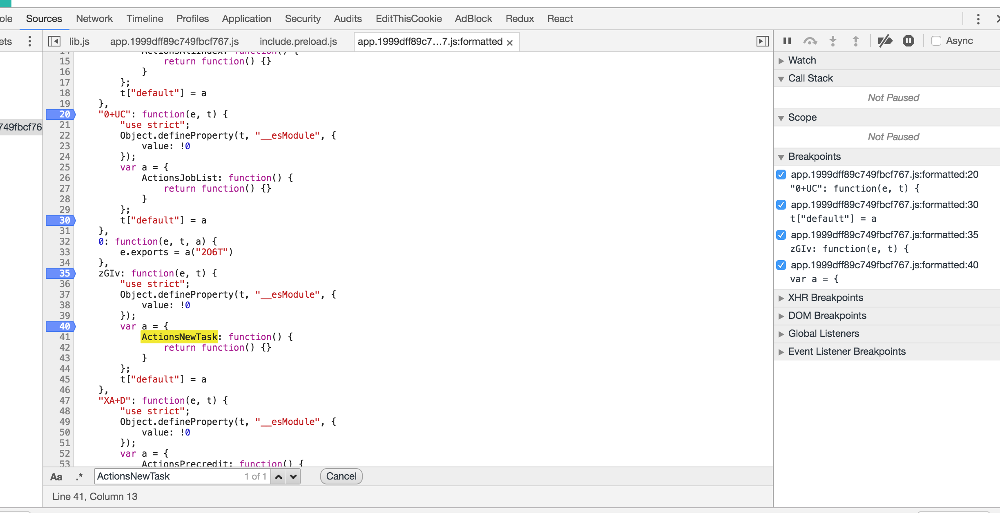

上图10：`0+UC` 模块 和 `zGIv` 模块是被单独的分开的，单独加在，因此两个模块都初始化一次，就能正常运行了！

***完成！以上就是在打包、压缩、优化、哈希后的运行情况！***

接着我们来看看，为什么在本地就可以运行呢？

----

## 九、本地 dev 环境下：

先理清关键的一些点：

### webpack-dev-server:

> This binds a small express server on localhost:8080 which serves your static assets as well as the bundle (compiled automatically). It automatically updates the browser page when a bundle is recompiled (SockJS). The dev server uses webpack’s watch mode. It also prevents webpack from emitting the resulting files to disk. Instead it keeps and serves the resulting files from memory.  - *from Webpack Official Site*


> When using watch mode, webpack installs file watchers to all files, which were used in the compilation process. If any change is detected, it’ll run the compilation again. When caching is enabled, webpack keeps each module in memory and will reuse it if it isn’t changed. - *from Webpack Official Site*

更多细节，请参看：[HOT MODULE REPLACEMENT WITH WEBPACK](https://webpack.github.io/docs/hot-module-replacement-with-webpack.html)。

这两段话已经讲得很清楚了，我们再来看一下在控制台下的文件目录结构

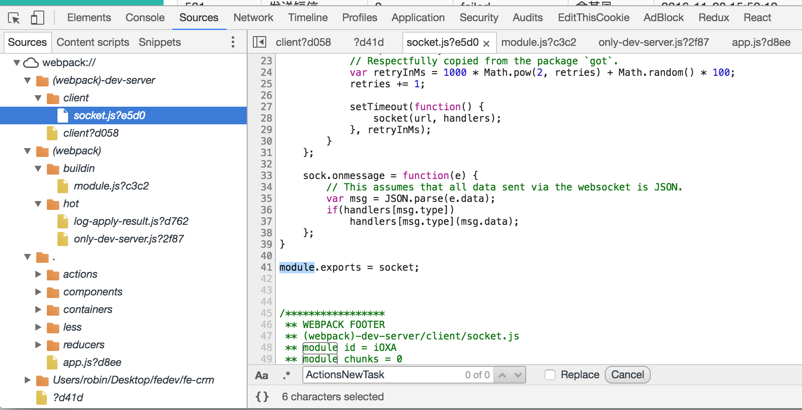

上图11：这是 webpack-dev-server 启动后，在本地浏览器打开的情况。


```
// 启动 webpack-dev-server 之后，Chrome Inspector 中 sources 的目录

├─┬ (webpack)-dev-server // 
│ ├─┬ client
│ │ └── socket.js?e5d0
│ └── client?d058
├─┬ (webpack)
│ ├─┬ buildin
│ │ └── module.js?c3c2
│ └─┬ hot
│ │ ├── log-apply-result.js?d762
│ │ └── only-dev-server.js?2f87
├─┬ .
│ ├─┬ actions
│ │ ├── A.js(?hash)
│ │ └── B.js(?hash)
│ ├─┬ components
│ │ ├── A.js(?hash)
│ │ └── B.js(?hash)
│ ├─┬ containers
│ │ ├── A.js(?hash)
│ │ └── B.js(?hash)
│ ├── less // 样式文件目录
│ ├─┬ reducers 
│ │ ├── A.js(?hash)
│ │ └── B.js(?hash)
│ └── app.js?d8ee // 入口文件
├─┬ Users/robin/Desktop/fedev/fe-crm // 项目相关的其他依赖库等
│ ├── ～ // 这个文件夹下是一些运行、调试文件
│ └── ...(这里的文件不列出了)
└── ?d41d
```

从目录来看，我们就可以猜到，在 dev 环境下，模块是应该是按需加载的--也就是说，不会同时加载可能发生冲突的两个模块(因为这两个模块在不同的路由下)。

下面我们需要验证这种猜测。

----

现在，我们已经验证了前面得出的***初步结论***！


也就是说，这个问题来自于Webpack 通过两个不同的 `IDs` 导入了***同一个模块***两次。Webpack 中 ES6 的 import 转译成 ES5 代码后，模块实现的机制变成了 CommonJS，而 CommonJS 的 `require()` 是同步的，也就是说在 webpack 在 `build` 之后，需要一次性加载所有的模块。在本 case 中，`zGIv` 模块被初始化了两次(初始化过程的抽象函数为 `ModuleEvaluation()`)，第一次调用 `ModuleEvaluation()` 时，`zGIv` 模块被初始化，同时 `zGIv` 模块对应的 `loaded` 被设置为 `true`；第二次初始化 `zGIv` 模块时，调用 `ModuleEvaluation()` 函数时返回 `undefined`。于是，程序在执行到 `lib.js` 中的 `return e[n].call(o.exports, o, o.exports, t),o.loaded = !0,o.exports;` 语句时，抛出以下错误：


```
lib.js:formatted:10 Uncaught TypeError: Cannot read property 'call' of undefined(…)

```

## 十、其他一些也会出现该错误的点：

1. 使用 `export {fileTypeArr, isImg}` 导出时，然后使用 `import {isImg}` 导出会出同样的错；而使用 `export {isImg, fileTypeArr}` 导出时不会出错(未究其原因，该错误视情况而定)。
2. 使用 `export {ABC}` 导出，使用 `import {abc} from someModule` 会出现本 case 中的错误，因为大小写不一致。


网上这样的问题比较少，以下是几个比较类似的问题：

[Duplicate module loaded multiple times](https://github.com/webpack/webpack/issues/2134)

[[bug] Module evaluated twice](https://github.com/webpack/webpack/issues/2740)