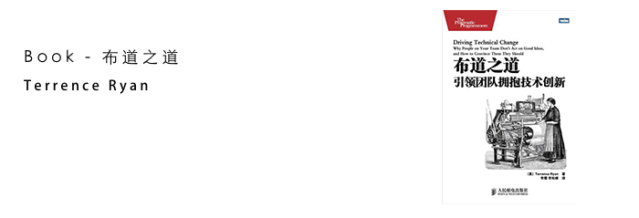

<blockquote class="blockquote-center">
知己知彼。入游其樊。
</blockquote>

<!-- more -->

[《布道之道－引领团队拥抱技术创新》](https://read.douban.com/ebook/388053/)

主要内容我就不加赘述了，直接找了几篇：

[看起来很高深，读来一般！](https://book.douban.com/subject/6990284/)

[拆书 NO.18：《布道之道：引领团队拥抱技术创新》（上）](http://www.jianshu.com/p/46a04a0ba4a5)

[拆书 NO.19：《布道之道：引领团队拥抱技术创新》（下）](http://www.jianshu.com/p/d6ce099274a4)

---

本书讲的是怎么让你的同事改变他们的工作方式。看完之后，我稍微想了一下，其实就是这三个步骤：

**首先，**你要知道知道自己需要达成什么目的？此为知己。

**其次，**达成这个目的你要说服哪些人，他们的各自的特点？此为知彼。

**接着，**“知己知彼”而后制定一个当前最为适合的策略并实施，最大化成功的概率。

而作者 Terrence Ryan 在本书中，重点剖析了你要说服的**“那些人”**的特点，根据不同个体、团队的不同特点，提出了几个“行之有效”的技巧和策略。

---

*注意点：*

1. ***“入游其樊”***。在传达自己的意图的时候，牢记讲的话不要吓跑听众或让他们感到不舒适，这样连进一步推进的机会都没了。
2. 对症下药。对于要说服听众的意图要有根据，你要明白自己新的意图，并阐述采用新的意图会解决现有的什么难题、带来什么样好处。
3. 劝不动时及时打住。
4. 莫求回报。团队至上。

