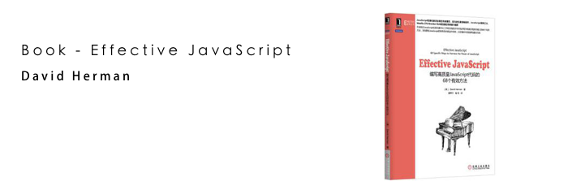

<blockquote class="blockquote-center">
“Before reading Effective JavaScript, I thought it would be just another book on how to write better JavaScript. But this book delivers that and so much more—it gives you a deep understanding of the language. And this is crucial. Without that understanding you’ll know absolutely nothing whatever about the language itself. You’ll only know how other programmers write their code.
 
Read this book if you want to become a really good JavaScript developer. I, for one, wish I had it when I first started writing JavaScript.”
<p> —— <strong>Anton Kovalyov, developer of JSHint</strong></p>
</blockquote>


   利用零散的时间看完了本书，书名叫 ***"Effective JavaScript"*** 十分贴切，本书给我带来的不仅仅是一些 JS 的编程建议，更多的是本书通过 68 个示例帮助我更好地理解了 JavaScript 语言本身。恰巧的是，我看完本书完之后方懂，了解 JavaScript 语言本身才是写出 Effective Code 的核心所在。要说这本书在使用 ES6 后还值得一看么？我认为值得一看，所谓继往开来，了解 JavaScript 语言的过去，之后才方知 ES6 给我带来了什么。
   
   同时，感兴趣的话，可以看看 Amazon 上的书评，十分精彩！

<!-- more -->

Amazon: [***Effective JavaScript - 68 Specific Ways to Harness the Power of JavaScript***](https://www.amazon.com/Effective-JavaScript-Specific-Software-Development/dp/0321812182) -  [David Herman](http://www.ccs.neu.edu/home/dherman/)，Rank: 4.9 out of 5 stars.

豆瓣：[《Effective JavaScript - 编写高质量的 JavaScript 代码的 68 个有效方法》](https://book.douban.com/subject/25786138/)

----

## 摘要：

### 一、让自己习惯 JavaScript:

1. 了解你使用的 JavaScript 版本。
2. 理解 JavaScript 的浮点数：JavaScript 的数字都是双精度的浮点数；JavaScript 中的整数仅仅是双精度浮点数的一个子集，而不是一个单独的数据类型；位运算符将数字视为 32 位的有符号整数；当心浮点运算中的精度陷阱。
3. 当心隐式的强制转换。
4. 原始类型优于封装对象：当做相等比较时，原始类型的封装对象与其原始值行为不一样。
5. 避免对混合类型使用 == 运算符：比较前尽可能清楚要比较的数据的转换行为是怎么样的。
6. 了解分号插入的局限。
7. 视字符串位 16 位代码单元序列。

### 二、变量的作用域：

8. 尽量减少全局对象。
9. 始终声明局部变量。
10. 避免使用 with。

No. 11 闭包

闭包的三个特点：

1. JavaScript 允许引用当前函数以外定义的变量；
2. 即使函数已经返回，当前函数仍可以引用外部函数所定义的变量，JavaScript 的函数值包含了调用它们执行所需的代码外，还包含其作用域内的变量；
3. 闭包可以读写外部变量的值，可以用来封装类对象。

----

No. 12 变量声明提升

1. JavaScript 是函数级作用域，不是块级作用域；
2. 块级作用域中声明的变量将提升到函数内；
3. 同一函数中重复声明相同变量是合法的；
4. ES6 中支持块级作用域。

----

No. 13 使用立即调用的函数表达式来创建局部作用域

``` javascript

function wrapElements(a) {
	var result  = [];
	for (var i = 0; i < a.length; ++ i) {
		result[i] = function() {return a[i]; };
	}
	return result;
}

var wrapped = wrapElements([10, 20, 30, 40, 50]);
var f = wrapped[0];
f(); // 不等于 10，而是 undefined

```

上面代码中，i 总是等于 5。

使用立即调用函数来创建局部作用域可以解决：

``` javascript

function wrapElements(a) {
	var result  = [];
	for (var i = 0; i < a.length; ++ i) {
		(function(j) {
			result[i] =function() { return a[j]; };
		})(i);
		
	}
	return result;
}

// 问题解决
// 注意：对于 for 语句块，在立即调用函数中不能使用 break、continue 之类的语句

```

----

No. 14 函数表达式笨拙的作用域


``` javascript

var f = function double(x) {
	return x * 2;
}

```

上面代码中，在不同的 JavaScript 环境中，会产生不同的影响。

情况一：函数只绑定到 `f` 中，通过 `double` 访问不到函数；而在非规范的环境中，`double` 又可能会产生变量提升，`double` 变量得到了提升，可以进行访问。为此，需要这样来修复：

``` javascript

var f = function double(x) {
	return x * 2;
}

var double = null;

```

情况二：

``` javascript
// 递归
var f = function find(tree, key) {
	if(!tree) {
		// 使用函数 find
		find(tree.left, key);
	}
}

// 在函数中使用 `find` 是合法的，`find` 的作用域在函数中有效；而对于函数之外就要当 ***情况一*** 来处理了。

```

 
``` javascript
// 递归
var f = function find(tree, key) {
	if(!tree) {
		// 使用函数 f
		f(tree.left, key);
	}
}

// 使用 f 调用时，函数在执行的时候会自动到外部作用域中找到 f;

```

要当心函数继承 `Object.prototype` 时产生的影响， 在 ES3 中函数表达式作用域会被 `Object.prototype` 污染，ES5 中修复了这个问题。

// TODO：了解 `Object`
 
----

15. 始终函数声明置于程序或被包含的函数的最外层以避免不可移植的行为。
16. 避免使用 eval 函数创建变量污染调用者的作用域。
17. 间接调用 eval 函数优于直接调用，意思就是说把 eval 赋值给一个变量；

使用函数：

18. 理解函数调用、方法调用、及构造函数调用之间的不同：方法调用将查找方法属性的对象作为接收者；函数调用将全局对象作为其接受者；构造函数需要使用 new 运算符，并产生一个新的对象作为接受者。
19. 熟练掌握高阶函数：高阶函数是那些将函数作为参数或者返回值的函数。
20. 使用 call 方法自定义接受者来调用方法：使用 call 方法可以调用在给定对象中不存在的方法。
21. 使用 apply 方法通过不同数量的参数调用函数。
22. 使用 arguments 创建可变参数的函数：目前在 Chrome 尝试访问 arguments(不能访问，已经被移除或者禁止访问，Chrome V53)。
23. 不要修改 arguments，会改变函数内的变量访问的目标参数，可以复制 `[].slice.call(arguments)` 后再进行修改。
24. 使用变量保存 arguments 的引用：同 this 一样，在函数嵌套的时候，访问的 arguments 参数会是当前函数下的 arguments。
25. 使用 bind 方法提取具有确定接受者的方法：`buffer.addChar.bind(this)`， 类似 `someFunc.call(receiver, arguments)`。
26. 使用 bind 方法实现函数柯里化(Currify)：`var urls = paths.map(simpleURL.bind(null, "http", siteDomain))`，其中 `simpleURL.bind()` 第一个参数为接受者，该函数返回一个委托到 `simpleURL("http", siteDomain, path)` 的新函数。
27. 使用闭包而不是字符串来封装代码：接受函数的 API 优于使用 eval 函数的 API，在 eval 中不要创建局部变量。
28. 不要信赖函数对象的 toString 方法：在使用纯 JavaScript 实现的引擎中，function 对象可以通过 toString 函数获得到函数代码，而在不同的环境中的表现是不一致的，在 Chrome 中，bind 函数是由其他编程语言实现的(通常是 C++)，宿主环境提供的是一个编译后的实现，`(()=> "Hello World!").bind(16).toString()` 显示为 **"function () { [native code] }"**；`(()=> "Hello World!").toString()` 显示为 **"()=> "Hello World!""**。
29. 避免使用非标准的栈检查属性：`arguments.callee` 指向 arguments 被调用的函数，`arguments.caller` 指向调用该 arguments 对象的函数；许多环境仍然支持 `arguments.callee`，它除了允许你明函数递归地引用其自身之外，没啥其他用途；使用它们来进行栈检查不具有良好的移植性。

### 三、对象和原型：

30. 理解 prototype、getPrototypeOf 和 __proto__ 之间的不同：C.prototype 属性是 new C() 创建的对象的原型；Object.getPrototypeOf(obj) 是 ES5 中检索对象原型的标准函数；obj:__proto__ 是件多对象原型的非标准方法。
31. 使用 Object.getPrototypeOf 函数而不要使用 __proto__ 属性；
32. 始终不要修改 __proto__ 属性，使用 Object.create 函数给新对象设置自定义原型。
33. 是构造函数与 new 操作符无关：使用 new 的时候要明确 new 的行为。
34. 在原型中储存方法：这样子就可以在多个实例中共享一个副本，方法存储于原型优于存储在实例中。现代浏览器优化了原型查找，将方法放到实例中并不会带来明显的速度提升，原型方法更加节省内存。
35. 使用闭包存储私有数据：闭包变量是私有的，可以实现信息隐藏。
36. 只将实例状态存储在实例对象中：原型共享，状态放在各个实例中。
37. 认识到 this 变量的隐式绑定问题：修复的方式可以传入 this，或者使用 bind(this)。
38. 在子类的构造函数中调用父类的构造函数：`SuperClass.call(this, someArguments)`。
39. 不要重用父类的属性名：虽然每个类的属性是“私有的”，但是在继承体系中的两个类之乡相同的**属性名**，那么它们指向的是***同一个属性***。
40. 避免继承标准类：例如 Array\JSON\Math 等等，继承标准类会破坏一些特殊的内部属性。
41. 将原型视为实现细节：对象是接口，原型是实现。
42. 避免使用轻率的猴子补丁：可以使用猴子补丁为缺失的标准 API 提供 polyfills。

### 四、数组和字典：

43. 使用 Object 的直接实例构造轻量级字典：轻量级字典应该是 Object.prototype 的直接子类，以使 for...in... 循环免受原型污染。
44. 使用 null 原型以防止原型污染：在 ES5 中使用 Object.create(null) 创建自由原型的空对象是不大容易被污染的；老的环境中可以考虑使用 `{__proto: null}`，但要注意 __proto__ 既不标准，也不能很好地被移植。
45. 使用 hasOwnProperty 方法避免原型污染：在使用 `toString in someObject` 等于 true，使用 hasOwnProperty 可以避免原型污染。
46. 使用数组而不要使用字典来存储有序集合：数组具有顺序，字典无确定顺序。
47. 绝不要在 Object.prototype 中增加可枚举的属性：如果确实需要的话，使用 ES5 中的 Object.defineProperty 方法将它们定义为不可枚举的属性。
48. 避免在枚举期间修改对象：在使用 `for()`、`for in` 语句时，不要修改枚举对象，如果对象在枚举期间可能会被改变，使用 while。
49. 数组迭代要优先使用 for 循环而不是 for...in 循环：for...in 可能会将枚举值转换成字符串。
50. 迭代方法优于循环：使用迭代方法(`Array.prototype.forEach` 和 `Array.prototype`) 替换 for 循环使得代码更可读，避免了重复循环控制逻辑。
51. 在类数组对象上复用通用的数组方法：类似 `[].forEach.call()`。
52. 数组字面量优于数组构造函数。

### 五、库和 API：

53. 保持约定一致：不要偏离用户在他们开发平台中可能遇到的约定。
54. 将 undefined 看做“没有值”。
55. 接收关键字参数的选项对象：使用对象作为参数，所有选项对象提供的参数应当视为可选的。
56. 避免不必要的状态：尽可能地使用无状态的 API，多个用户或者实例使用这个 API 的时候不会相互影响。
57. 使用结构类型设计灵活的接口。
58. 区分数组对象和类数组对象。
59. 避免过度的强制转换：考虑防御性地监视非预期的输入。
60. 支持方法链：使用方法链来连接无状态的操作。

### 六、并发：

61. 不要阻塞 I/O 事件队列：异步 API 使用回调函数来延缓处理的高昂代价以避免阻塞主程序；JavaScript 并发地接收事件，但会使用一个事件队列按序处理事件；在应用程序中绝不要使用阻塞的 I/O。
62. 在异步序列中使用嵌套或命名的回调函数：避免将可并行执行的操作顺序化执行；避免将需要序列化执行的操作并发执行。
63. 当心丢弃错误：事实上，异步的 API 甚至根本不可能抛出异常，因为一个**异步**的错误发生时，没有一个明显的执行上下文来抛出异常。？相反，异步的 API 倾向于将错误表示为**回调函数**的特定参数；通过编写共享的错误处理函数来避免复制和粘粘错误处理代码。
64. 对异步循环使用递归：需要反复调用执行同一个异步操作(例如：下载一个文件直到成功为止)进行递归调用，可以防止调用栈溢出。
65. 不要在计算时阻塞事件队列：避免在主事件队列中执行代价高昂的算法。
66. 使用计数器来执行并行操作：JavaScript 应用程序中的事件发生时不确定的(例如：下载十个大小不尽相同的文件，先开始的文件未必比后开始的小文件更早下载完成)，因此顺序不可预测。在举的例子中，最后一个完成的一个文件可能是第一个开始下载文件，因此，最晚开始下载的一个文件下载完成并不能指示全部文件已经下载完成。使用一个计数器，对这十个操作的完成情况进行计数，可以解决。
67. 绝不要同步地调用异步的回调函数：即使某个操作可以立即得到数据，也绝不要同步地调用异步回调函数；同步的调用**异步的回调函数**扰乱了预期的操作序列，并可能导致意想不到的交错代码；同步地调用异步的回调函数可能导致**栈溢出**或**错误地处理异常**。
68. 使用 promise 模式清洁异步逻辑：promise 可以看作是**表示最终值的对象**，使用 promise 组合不同的并行操作。

---

> 这本书写得很好，内容深入浅出，很值得一看。由于忙着弄毕业的事情，只看到了第17条就没看下去了。回头再抱起来看。-- 2016-04-25 19:48:43(这段话是今年四月的时候，在图书馆写的，感慨光阴似箭)

----

by Robin

7 pm October 25, 2016 Tuesday

at No.4 Wangjing East Road.

