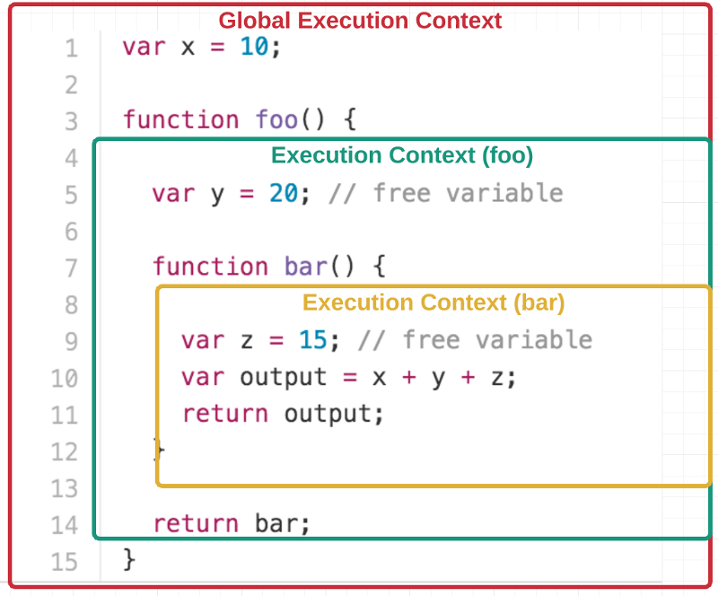

> 当你足够了解时，所有东西可以简单地被阐述。

## 语言特性

### 引用和值

**原始值**是直接保存在变量中的，原始值包括**字符串、数字、布尔值、null 和 undefined**。

引用类型的值通过指向内存的指针访问，包括**对象、数组、日期**

1. 引用类型的变量在赋值、拷贝、删除等操作的时要小心，ES6 中可以使用 `Object.assig({}, objToCopy)` 来实现“深拷贝”。
2. 请小心在对象中的函数里使用 `this`，尽量不要用，避免执行上下文引起的 `this` 绑定特征异常。

### 作用域

1. JavaScript 只有两种作用域：**函数作用域**和**全局作用域**。`while`、`if`、`for` 语句没有自己的作用域，这个有区别于其他的语言中存在的块作用域(block-scope)，但是 ES6 中引入了 `let类型` 的变量实现了块作用域。
2. 基于浏览器的 JavaScript 中，所有的全局变量实际上是做为 `window` 对象的属性存在的。其他环境下，所有的全局变量属于某个全局上下文。同时，也可以说，`window` 是基于浏览器的 JavaScript 的全局上下文。
3. 当变量没有声明明确的作用域时，将自动提升到全局作用域。例如：`function fn(){ foo = 'a';}` 中的 `foo` 将自动提升(called hoisting)到全局上下文 `window` 中，可以通过 `window.foo` 访问。

### 上下文(Execution Context)

1. JavaScript 代码执行时总是拥有上下文(即代码的执行环境)。上下文是一件有力的工具，是**面向对象代码必不可少的组成部分**。
2. 函数中的 `this` 基于被调用时上下文确定，可以使用 `this` 来访问上下文。全局上下文中 `this` 指向于 `window`，也就是 `this === window` 为 `true`。函数中的 `this` 指向于该函数被调用时所处的上下文环境；当 `this` 指向于 `undefined` 时，`this` 会自动指向 `window`。

### 闭包(Closures)

**闭包在技术上的定义**：内部函数在其父函数执行结束之后，依然能够引用其外围函数(outer enclosing functions，不仅仅是父函数)中的变量。

闭包示意图

1. 闭包可以用于函数柯里化。
2. 通过自执行的匿名函数(self-executing anonymous function)直接调用可以实现闭包，将所有的全局变量都隐藏起来，避免变量污染。jQuery 也使用到这一特性。
3. 闭包所访问的父函数中的变量不是该变量创建时的值，而是父函数执行完成时的那个值。例如，在子函数中访问父函数中的 `for(var i = 0; i < 10; ++i){}` 循环中的循环变量 `i`，无论何时，子函数通过闭包访问到 `i` 的值都为 `10`。

### 函数重载与类型检查

函数重载：

其他面向对象的语言的共性是能够对函数进行**重载**，根据传入参数的类型和数量来执行不同的操作。每个 JavaScript 函数内部都有一个名为 `arguments` 的上下文变量。该变量类似数组但有异于数组，与 `Array` 并不共享原型对象。所以，在 Chrome 的 console 中执行 `(function () {console.log(arguments);})('test')` 和 `[]`，你会看到前者的原型为 `Arguments`，后者为 `Array`。

因此，不要尝试直接去修改 `arguments` 变量，而是拷贝后进行操作。

类型检查：

1. 使用 `typeof` 进行类型检查，无需事先知道变量的类型。
2. 使用 `instanceof` 用于测试变量是否是某种特定变量。

### 对象 Object

1. 通过使用 `Object.preventExtensions()` 来阻止新的属性添加到对象中。企图添加新的属性会导致 `TypeError` 或静默失败，严格模式下出错的几率更高。
2. 使用 `Object.seal()` 能够限制对象的能力。与 `Object.preventExtensions()` 不同的是， `Object.seal()` 作用之后，对象属性不能删。
3. 使用 `Object.freeze()` 是三者中最严格的，无法添加、删除或更新属性。如果属性本身是一个对象的话，那么该对象是可以更新的，这个叫浅冻结(shallow freeze)。

----

Robin on February 17, 2017 Fri.

