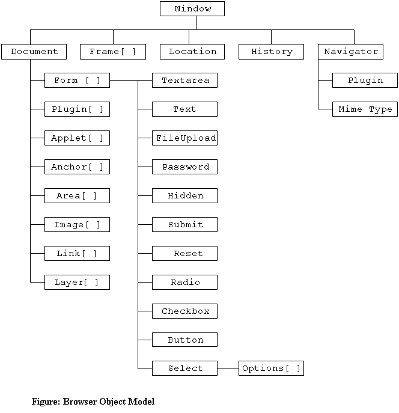

DOM, Document Object Model(中文：文档对象模型)是专业的 JavaScript 程序员必须掌握的。

历史上，DOM 的接口更新不同步于浏览器或 JavaScript 的更新，存在缺陷的实现，而 jQuery 和 Dojo 的出现是为了解决这些问题。现代浏览器中，DOM 已经规范化了，接口也相当稳定。

DOM 采用 `DOM Level n` 来进行版本标识，目前最新是 [DOM4](https://www.w3.org/TR/dom/)。

一些 Tips：

1. 使用 `<!DOCTYPE html>` 做为文档的开头，避免浏览器回退到怪异模式(quirks mode)。
2. 倾向于使用 `<script>` 标签引入独立的 JavaScript 文件。
3. 脚本标签 `<script>` 应放在 HTML 文档底部，紧靠封闭的 `</body>` 前。


## DOM 结构

Document 通常看做一个整体，文档中的每个标签都是一个 `Element`。



整个 `window` 对象的结构


HTML 树结构


### DOM 中的相互关系

代码一：

``` javascript
<ul>
<li>node</li>
<li><span>node</span><a href="#">node</a><p>node</p></li>
<li>node</li>
</ul>
```


代码一对应的关系图

注意：DOM 中的空白字符(white space)会引起 DOM 文档的访问行为异常，换行符会被认为是一个空白字符。

### 访问 DOM 元素

1. 访问特定元素最快的方法 `document.getElementById()`。
2. `getElementsByTagName(li)` 返回实时变化的 NodeList(类似数组)，文档变化会更新返回的结果。而 `getElementsByClassName()` 返回的是实时变化的 HTMLCollection。两者行为相像，返回的结果有差异，差异来自于**浏览器对于 DOM 的实现不一致**。未来他们都会返回 HTMLCollection。
3. 和 `getElementsByTagName(li)`、`getElementsByClassName()` 能用于 `Element` 类型实例不同，`document.getElementById()` 只能用于文档或者 `Document` 类型实例。
4. `querySelector()` 和 `querySelectorAll()` 能用于 `Element` 类型实例上，两者的区别是前者返回第一个元素的引用，而后者返回一个不会实时更新的 `NodeList`。

### 等待 HTML DOM 载入

即使把 `<script>` 放在文档的尾部，也不能保证 JavaScript 访问的 DOM 是完整的。

可以使用 `window.addEventListener('load', function(){})` 来实现，这种方法最简单，但是也最慢。需要等到所有包含 `src` 属性的元素加载完才会触发 `load` 事件。而这也是向后兼容最好的解决方案。

现代浏览器支持很可能会支持 `DOMContentLoaded` 事件，该事件在文档完全加载并解析后触发，可以进行相应的检查，然后调用 `window.addEventListener('DOMContentLoaded', function(){})`。

### 获取元素内容

1. 获取文本内容。通过 `Element.firstChild.nodeValue`。
2. 获取元素的 HTML。使用 `.innerHTML` 来获取，会同时返回 HTML 节点和文本。

### 使用元素特性

类似 `form` 元素，会有一些元素的特性，通过 DOM 获取之后，可以进行一定的操作，如： `formElem.attributs = {name: 'myForm'}` 等。

### 元素的属性值获取和设置

获取：`document.getElementById('some-id').getAttribute('id');`。

设置：`document.getElementById('some-id').vlue = 'someValue';` 或者 `document.getElementById('some-id').setAttribute('id', 'newId')`。

可以自己实现一个统一的元素属性访问函数进行相应的操作。

----

## 修改 DOM


1. 使用 `document.createElement()` 创建元素。
2. 使用 `insertBefore()` 和 `appendChild()` 插入。
3. 使用 `.innerHTML` 插入 HTML 文档，如：`document.getElementById('some-id').innerHTML = '<li>some contents</li>'`。同时，`.innerHTML` 可能不存在；新的 HTML 会覆盖旧的 HTML。
4. 使用 `NodeParent.removeChild(NodeToMove)` 来删除节点。
5. 使用自己包装过的函数访问节点或采用第三方库进行访问能够一定程度上保持 DOM 访问确定性。

⚠️注意：访问 DOM 时要时刻谨记**空白符**可能导致的影响。

----

Robin on February 17, 2017 17:00 at Maoyan corridor.
