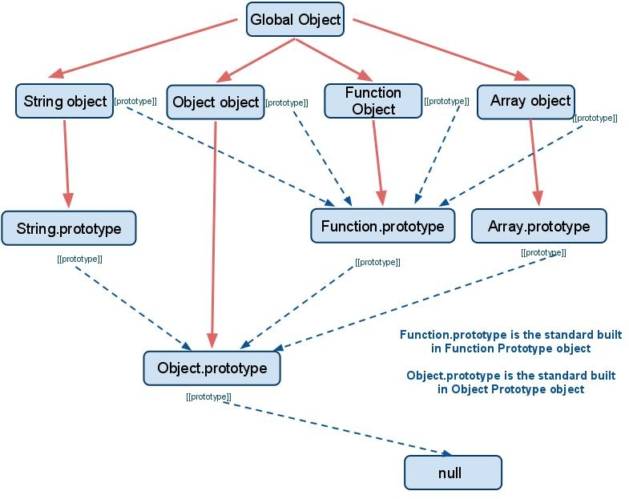

JavaScript 是一门**基于原型而非基于类**的语言。Java 中一切都基于类，JavaScript 一切都基于原型，所以 JS 是基于原型的。

基于对象编程能够简化重用。

JavaScript 所有类型都拥有**原型**，有两种方法可以访问：非标准的 `__proto__` 和 `prototype` 类型。ES6 中 `__proto__` 成为一个正式的属性。在 Chrome Version 56.0.2924.87 中，只能通过 `__proto__` 访问该属性。

创建一个原型：

1. `let newProto = {};`
2. `let obj = Object.create(newProto);`
3. `obj.__proto__ === newProto` 为 `true`

### 继承问题

1. 面向对象的代码通过设计通用父类到更具体的子类来实现功能重用。JavaScript 通过 `Object.create()` 实现继承，但不允许多继承(同时继承一个以上的对象)。
2. 同时也可通过拷贝对象内所有值的方式来实现类似的“继承”，可以自己写出面向对象语言中类似的 `extend()` 和 `super()` 函数来完成相应的功能。例如，`extend(someObj)` 先执行 `let tmp = Object.create(this)` 来继承本身，然后把 `someObj` 的所有属性复制到 `tmp`，最后返回 `tmp`。
3. 通过 `superObj.isProtypeOf(subObj)` 来判断继承关系。

### 成员可见性

JavaScript 没有直观的修饰器(public、protected、private等)来控制对象中变量成员的访问。JS 中只存在**全局作用域**和**当前执行函数的作用域**，而我们可以通过**闭包**来实现，内部声明的成员不会被外部上下文访问到。而使用闭包来控制访问会带来内存开销方面的问题。

ES6 中对 `class` 关键字进行了实现，加入了 `super`，不过这个只是语法糖而已。

----

### 命名空间问题

1. 命名空间是一种封装独立代码的方案。类似 jQuery 使用 `$`，结合必要的代码来解决命名空间冲突问题。
2. JavaScript 的命名空间为变量和函数提供上下文。
3. 命名空间是全局的。

### 模块模式

利用函数来生成命名空间。有些工具可以改进命名空间的使用方式，比如模块模式(module pattern)将生成的命名空间的功能**封装进函数**。

### 立即调用的函数表达式(IIFE)

为避免污染全局命名空间，可以使用函数。函数在运行时会创建自己的执行上下文，该上下文属于全局命名空间，又不会和全局命名空间相互干扰。

----

Robin on February 17, 2017 15:42 at Office.
